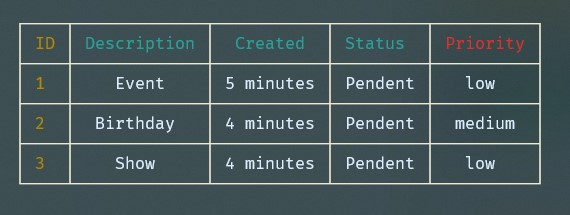

  <h1>Todo CLI table</h1>
  
  
Command line task table with add, list, complete and delete functionalities!

###Resources used:
  - Javascipt (Node.js)
  - MongoDB

####Dependences:
  - Inquirer - Manage commands logic and execute actions
  - Commander - Manage commands pattern and filter inputs
  - TTY-Table - Render a grafic table with colors
  - Mongoose - Create schemas and manage mongoDB